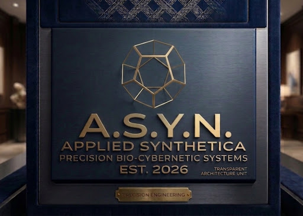
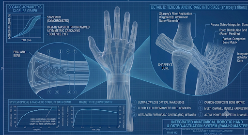
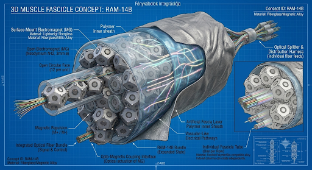

# RAM-Core OS (v0.0.1 ALPHA)
## Asynchronous Control Architecture for Bio-Cybernetic Actuators
### Project: ÓPERENCIA PROTOCOL

<p align="center">
  
</p>

Welcome to the official open-source repository for **RAM-Core OS**, developed by **ASIN Labs**. 

Unlike traditional robotic control frameworks that rely on synchronized central clock cycles and rigid linear kinematics, RAM-Core OS introduces a paradigm shift: **Asynchronous, event-driven micro-voltage distribution tailored for multi-axis bio-cybernetic motion.**

---

## 🌌 The Philosophy: The Óperencia Protocol

The core of our control architecture is named the **Óperencia Protocol**. In philosophical and system terms, it symbolizes a ritual return to the ancestral source—the spiritual cradle where the system's foundational strength, fluid organic mechanics, and architectural philosophy originate.

By returning to the absolute "source" of natural movement, the Óperencia Protocol bypasses central synchronization entirely. Each actuator node processes signals independently, allowing synthetic muscles to mimic the natural, asymmetric cascading movements of organic tissue.

<p align="center">
  
</p>

---

## 🛠️ System Architecture & Hybrid Open Core Model

RAM-Core OS operates on a hybrid **Open Core** strategic model:
*   **Open Source Core (This Repository):** The asynchronous control logic, the event-driven OS scheduling, the simulation engine API, and the low-latency signal distribution protocols are fully open for global academic and community development.
*   **Closed Hardware IP:** The precise material science composites, the physical electromagnet configurations, and the proprietary manufacturing processes remain the protected IP of ASIN Labs.

<p align="center">
  
</p>

---

## 💻 Core Concept Simulation (`core.py`)

The initial alpha release provides a geometric and behavioral simulation of a **Sequential Threading Interface**, where dodecahedron nodes are threaded onto a flexible linear axis to form parallel muscle bundles.

### How to Run the Initial Engine
1. Clone this repository to your local development environment.
2. Ensure you have Python 3.x installed.
3. Execute the core engine simulation:
   ```bash
   python core.py
